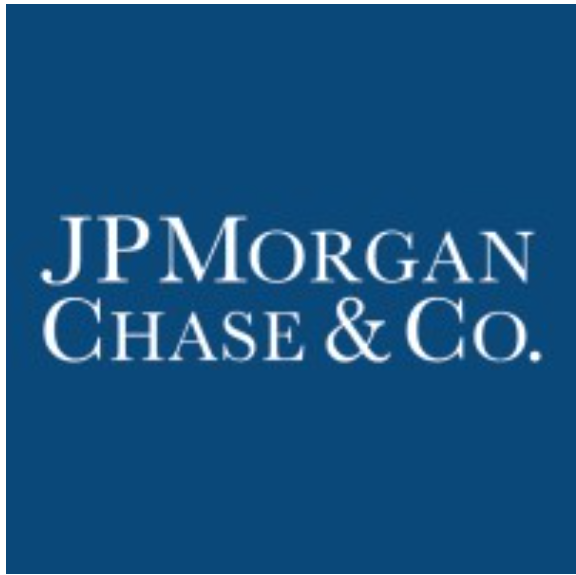

# ai-case-study
Assignment for AI/ML Bootcamp Module 1 Challenge
# Case Study:  JPMorgan Chase & Co. 

## Overview and Origin

JPMorgan Chase & Co. is an American multinational financial services firm headquartered in New York City. It is the largest bank in the United States and the world's largest bank by market capitalization as of 2023.  As the largest of the [Big Four](https://en.wikipedia.org/wiki/Big_Four_(banking)#United_States "JP Morgan Chase, Bank of America, Citigroup, and Wells Fargo") banks, the firm is considered [systemically important](https://en.wikipedia.org/wiki/Systemically_important_financial_institution "a bank, insurance company, or other financial institution whose failure might trigger a financial crisis.") by the Financial Stability Board. Its size and scale have often led to enhanced regulatory oversight as well as the maintenance of an internal ["Fortress Balance Sheet"](https://www.youtube.com/watch?v=G8DvO205ZU0 "https://www.youtube.com/watch?v=G8DvO205ZU0") of capital reserves. [Wikipedia](https://en.wikipedia.org/wiki/JPMorgan_Chase "https://en.wikipedia.org/wiki/JPMorgan_Chase")

### Company Profile

| | | 
| --- | --- |
| **Chairman & CEO** | [Jamie Dimon](https://www.jpmorganchase.com/about/our-leadership/jamie-dimon "https://www.jpmorganchase.com/about/our-leadership/jamie-dimon") |
| **Stock Symbol** | [JPM (NYSE)](https://finance.yahoo.com/quote/JPM?p=JPM "https://finance.yahoo.com/quote/JPM?p=JPM") |
| **Headquarters** | 323 Madison Avenue |    
| | New York, NY 10179 |   
| | United States | 
| | 212 270 6000  |
| **Website** | [jpmorganchase.com](https://www.jpmorganchase.com "https://www.jpmorganchase.com") |
| | |
| **Industry** | Major International Banks |
| **Sector** | Financial Services |
| | |
| **Fiscal Year-End** 12/2023 | **Revenue** $157.54B |
| **Net Income** $37.49B | **2022 Sales Growth** 24.82% |
| **Employees** 308,669 | |

### Company History

**Company Incorporation:**

Dec 31, 2000 -- J.P. Morgan & Co. Incorporated merged with The Chase Manhattan Corporation. The new firm was named J.P. Morgan Chase & Co.

**Incorporation History:**
>JPMorgan Chase, in its current structure, is the result of the combination of several large U.S. banking companies, merged since 1996, combining Chase Manhattan Bank, J.P. Morgan & Co., and Bank One, as well as asset assumptions of Bear Stearns, Washington Mutual, and First Republic. Predecessors include additional historic, major banking firms, among which are Chemical Bank, Manufacturers Hanover, First Chicago Bank, National Bank of Detroit, Texas Commerce Bank, Providian Financial and Great Western Bank. The company's oldest predecessor institution, The Bank of the Manhattan Company, was the third oldest banking corporation in the United States, and the 31st oldest bank in the world, having been established on September 1, 1799, by Aaron Burr. [Wikipedia](https://en.wikipedia.org/wiki/JPMorgan_Chase "https://en.wikipedia.org/wiki/JPMorgan_Chase")

**Company Founders:**
- Aaron Burr (Bank of the Manhattan Company)
- Balthazar P. Melick, John C. Morrison, Mark Spenser, Gerardus Post, James Jenkins, William A. Seely, and William Stebbins (Chemical Bank)
- John Pierpont Morgan (J.P. Morgan & Co.)
- John Thompson (Chase National Bank)

**Fun Fact**
*Believe it or not, JPMorgan Chase & Co. started as a water business.  The Manhattan Company was founded in 1799 for the purpose of providing quality drinking water.  Who would have guessed that it would grow into the world's the fifth-largest banking institution with $3.9 trillion in total assets.* 

> **1799**  
> **The Manhattan Company is founded**  
> - The Manhattan Company, JPMorgan Chase's earliest predecessor institution, is chartered by the New York State legislature to supply "pure and wholesome" drinking water to the city's growing population.  Among its founders are Alexander Hamilton and Aaron Burr.  
> - A provision in the charter allows The Manhattan Company to use its surplus capital for banking operations.  Within five months, The Bank of The Manhattan Company opens for business, becoming the second commercial bank in New York City after Hamilton’s Bank of New York. [JPMorgan Chase](https://www.jpmorganchase.com/about/our-history "https://www.jpmorganchase.com/about/our-history")

## Company Business Structure, Profitablity, and Technology

### Company Business Structure 
Financial services companies make money in two ways:
- Interest charged on customer loans
- Fees charged for customer products and service

JP Morgan & Co. does an excellent job of managing their capital to offer a broad range of financial products and services in each of their business segments.

**Company Business Segments**

> JPMorgan Chase & Co. operates as a financial services company worldwide.  It operates through four segments: Consumer & Community Banking (CCB), Corporate & Investment Bank (CIB), Commercial Banking (CB), and Asset & Wealth Management (AWM).
>> - The CCB segment offers deposit, investment and lending products, cash management, and payments and services to consumers and small businesses; mortgage origination and servicing activities; residential mortgages and home equity loans; and credit cards, auto loans, leases, and travel services.
>> - The CIB segment provides investment banking products and services, including corporate strategy and structure advisory, and equity and debt markets capital-raising services, as well as loan origination and syndication; payments and cross-border financing; and cash and derivative instruments, risk management solutions, prime brokerage, and research. This segment also offers securities services, including custody, fund accounting and administration, and securities lending products for asset managers, insurance companies, and public and private investment funds.
>> - The CB segment provides financial solutions, including lending, payments, investment banking, and asset management to small and midsized companies, local governments, nonprofit clients, and large corporations; and commercial real estate banking services to investors, developers, and owners of multifamily, office, retail, industrial, and affordable housing properties.
>> - The AWM segment offers multi-asset investment management solutions in equities, fixed income, alternatives, and money market funds to institutional clients and retail investors; and retirement products and services, brokerage, custody, estate planning, lending, deposits, and investment management products.
>> - The company also provides ATM, online and mobile, and telephone banking services. [Yahoo! Finance](https://finance.yahoo.com/quote/JPM/profile?p=JPM "https://finance.yahoo.com/quote/JPM/profile?p=JPM")

### Company Profitability

**Topic 1 Company Profitablitiy**

### Company Technologies and Investment

**Topic 1 Technology and Investment**

## Financial Services Landscape

### Major Trends and Innovations in Financial Services

**Topic 1 Major Trends and Innovations in Financial Services**

### Key Competitors

**Topic 1 Key Competitors**

## Business Impact and Financial Performance

### JPM Business Impact
- Include historical impact
- More current impact

### Core Metrics used to measure Financial Services success?

### Competitive analysis of how JPM performing vs. the competitors

## Recommendations

### Recommendation 1

**What products and services would I suggest JPM offer?**

**Why would these products and services benefit JPM?**

**What technology would this new product or service require?**

**Why are the technologies appropriate for my solution?**

### Recommendation 2

**What products and services would I suggest JPM offer?**

**Why would these products and services benefit JPM?**

**What technology would this new product or service require?**

**Why are the technologies appropriate for my solution?**

**END OF FILE**